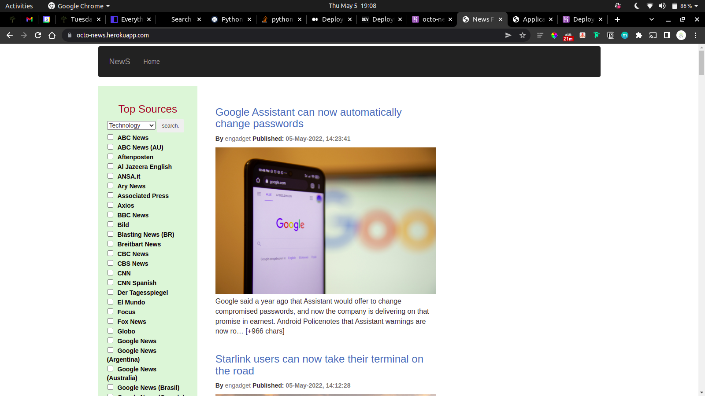

# News Time

This is a Flask application that will fetch news from the newsapi.org API and display them on a webpage.

Users can search for news by news source, or category.

## Table of Contents

- [Technologies Used](#technologies-used)
- [Features](#features)
- [Screenshots](#screenshots)
- [Setup](#setup)
- [Usage](#usage)
- [Project Status](#project-status)
- [Room for Improvement](#room-for-improvement)
- [Acknowledgements](#acknowledgements)
- [Contact](#contact)

# Technologies Used

- Python3.8
- Flask
- Newsapi.org
- Bootstrap
- Font Awesome
- Google Fonts

# Features

- Search for news by news source or category
- Display news in a grid view

# Screenshots


# Setup

To setup the application:

```sh
$ git clone https://github.com/Willbeckh/octo-news.git
$ cd octo-news
$ pip install -r requirements.txt
$ python3.8 run.py
```

> Before running the application, you must create a [News](newsapi.org) API key
> and export it to the environment variable `NEWS_API_KEY`.

# Usage

The application is accessible at the following URL: [News app](https://octo-news.herokuapp.com/)

This application contains unit tests for the application.

### Running the tests

```sh
$ python3 -m unittest discover tests
```

# Project Status
Project is still under development
NB: feel free to fork and take a look at the code

## Room for Improvement

- Polish the application UI
- Add contact form

## Acknowledgements
- [Flask](https://flask.palletsprojects.com/) 
- [Newsapi.org](https://newsapi.org/)
- [Bootstrap](https://getbootstrap.com/) 
- [Font Awesome](https://fontawesome.com/)

## Contact
1. [Twitter](https://twitter.com/billyndirangu)
2. [LinkedIn](https://www.linkedin.com/in/willbeckh-ndirangu/)

&copy; 2022 Willbeckh-Ndirangu
<p>made with ❤️ by willbeckh </p>